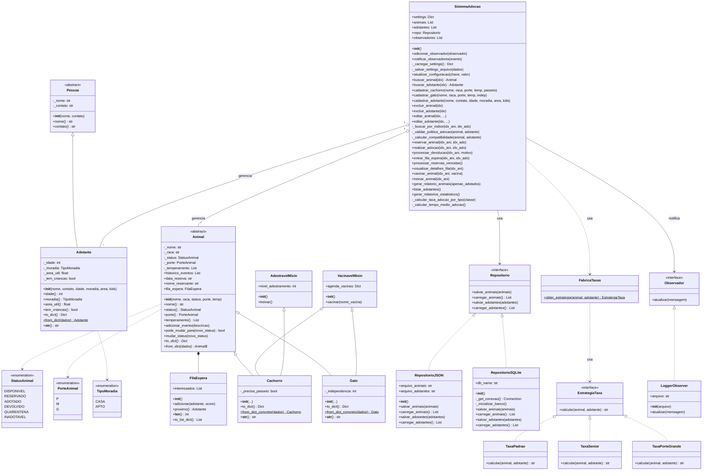

<div align="center">

# 🐾 adote-me.org


Este é um sistema de linha de comando (CLI) para gerenciar o fluxo completo de um abrigo de animais. Ele controla desde o cadastro de animais e a triagem de adotantes até o processo de reserva, adoção e devolução.

# ⛳ Objetivo

O objetivo principal é aplicar conceitos de Programação Orientada a Objetos (POO) para construir um sistema robusto e flexível. O projeto foca em modelar entidades do mundo real, gerenciar seus estados e implementar regras de negócio complexas de forma organizada e testável.

</div>

## Estrutura de arquivos

```
📁 ADOTE-ME.ORG/
│ 
├── 📄 .gitignore
├── 📄 README.md
├── 📄 requirements.txt
├── 📄 pytest.ini
├── 📄 seed.py
├── 📄 settings.json
├── 📄 adocao.db
├── 📄 adotantes.json
├── 📄 animais.json
│
├── 📁 dados/
│    └── 📄 historico_eventos.log
│
├── 📁 relatorios/
│    └── 📄 relatorio_2025-12-15_01-58-12.txt
|
├── 📁 src/
│    └── 📁 adocao/
│         ├── 📄 __init__.py
│         ├── 📄 enums.py
│         ├── 📄 domain.py
│         ├── 📄 strategies.py
│         ├── 📄 repositories.py
│         ├── 📄 services.py
│         ├── 📄 exceptions.py
│         └── 📄 main.py
│
├── 📁 tests/
     ├── 📄 __init__.py
     ├── 📄 test_domain.py
     ├── 📄 test_fila_priorizada.py
     ├── 📄 test_observer.py
     ├── 📄 test_services.py
     └── 📄 test_strategies.py
```


# 🎡 Funcionamento

### 1️⃣ Clone o repositório

```bash
git clone https://github.com/jetrokepler/adote-me.org.git
cd seu-projeto
```

### 2️⃣ Crie e ative o ambiente virtual

```bash
python -m venv .venv

# Windows
.venv\Scripts\activate

# Linux / macOS
source .venv/bin/activate
```

### 3️⃣ Instale as dependências

```bash
pip install -r requirements.txt
```

### 🌳 Semeando o db

```bash
python seed.py
```


### 🧪 Executando os Testes

Todos os testes são feitos com **Pytest**:

```bash
pytest
```

Com relatório mais detalhado:

```bash
pytest -v
```

### 🧪 Modo on

Esse é o comando que incializa o progama.

```bash
python src.adocao.main
```


# 🏛️ Arquitetura


